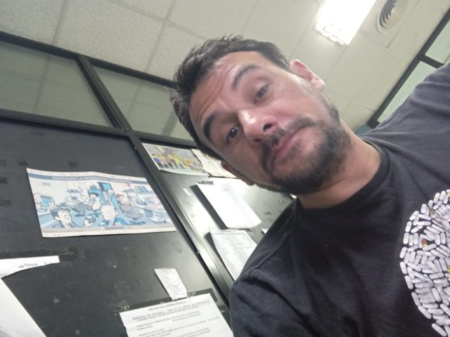
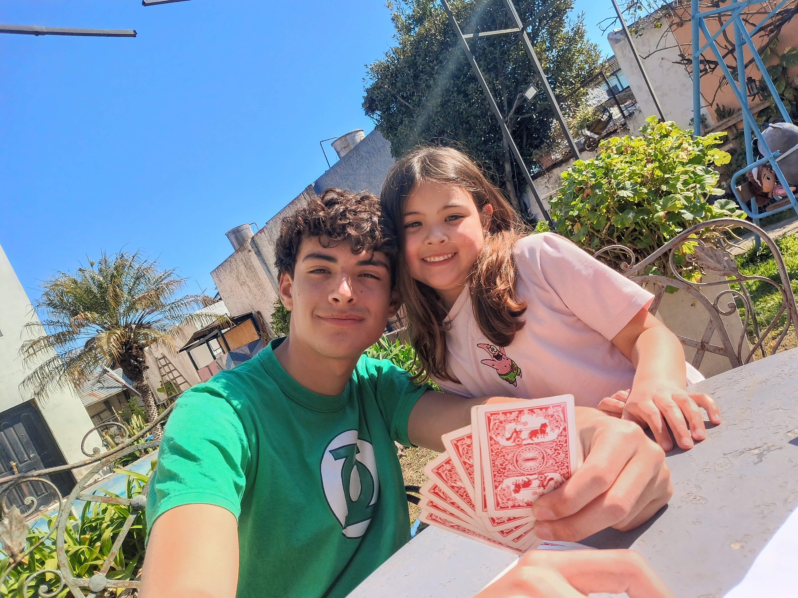
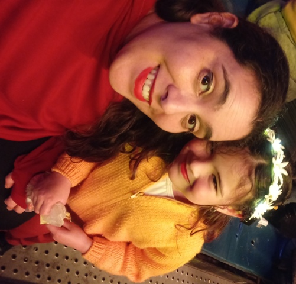

# Programación con objetos I
## Presentación Personal

## Mi nombre es Pablo Hernán Baudraco
Soy de Hurlingham, tengo 49 años y terminé hace mucho, pero mucho tiempo el nivel secundario, allá por el año 1999 en el centro educativo (CENS) nro. 451, con el título obtenido de “Perito en desarrollo de comunidades”. Por diferentes razones de la vida y por priorizar el trabajo antes que la educación, terminé en una escuela para adultos. Después de algunos intentos fallidos por distintas universidades, abandoné mi etapa como estudiante.
Tengo una familia maravillosa: María mi esposa, tiene 39 años y de profesión protesista dental; tenemos dos hermosos hijos, Bautista Ezequiel de 15 años, que estudia el 4 año del nivel secundario en el colegio Sagrado Corazón de Jesús en Hurlingham y Catalina Guadalupe de 5 años, que esta en su ultimo año del nivel inicial en el jardín Estrella de Belén de la misma localidad.
Trabajo actualmente en Sancor cooperativas unidas limitada en la localidad de Don Torcuato, hace 19 años que me desempeño como soporte de TI en el departamento de sistemas en el turno de la noche y brindamos el soporte para todas las sucursales del país. Salvo por algunos pormenores me apasiona mi trabajo y es más o menos a lo que siempre me dedique: arreglos de PC, instalaciones de software, instalaciones de sistemas operativos, el mantenimiento y control de todos recursos informáticos de la empresa en general. En estos momentos me siento un poco estancado con el trabajo en cuanto al crecimiento profesional y esa es una de las razones por la cual me decidí a estudiar programación. La otra es porque me encanta programar y me gustaría poder hacerlo profesionalmente.
Me sentía un poco aterrado con la idea de volver a empezar, por mi edad y por los intentos anteriores que me dejaron medio traumado, es como que dude mucho de volverlo a hacer. Pero decidí seguir el consejo de mi esposa y así conocí a la universidad de Hurlingham lo que más me atrajo de la Unahur es la calidad humana con la que te reciben y el trato cordial por parte de todos. 
### A continuación: mi familia...

### Que espero...
- Este no es mi primer contacto con github tengo perfil de hace unos años pero muy poca experiencia en usarlo
- Me gustaría mucho poder aprender estas herramientas para poder fortalecer mi educación profesional

#### Me da un poco de pánico lo que dicen por ahí de que cada vez son menos los programadores y que la IA nos va a dejar atrás. Pero confió en que aprender lo que me apasiona, me va llevar por los caminos correctos....
